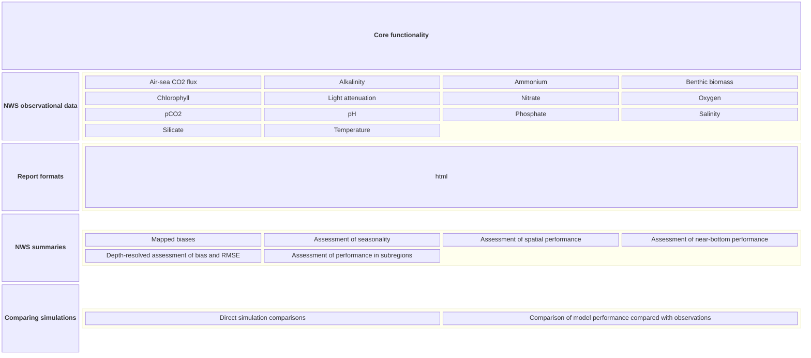
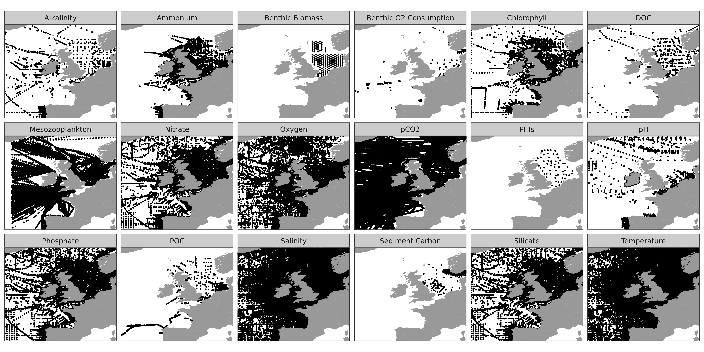

# ecoval
Marine ecosystem model validation made easy in Python

ecoval is a fully automated marine ecosystem model tool that reduces ecosystem model validation to a simple to follow step-by-step producedure. It is designed to validate ecosystem models stored in NetCDF format against a range of in-situ and gridded observations. Currently, it uses curated data sets for validations of models on the northwest European shelf. 

# ecoval functions

The core functionality of ecoval is to match up model output with observational data, and then validate the model output against the observations. The following functions are available:
- `matchup`: Matches model output with observational data for validation.
- `validate`: Generates validation reports based on matched data.
- `compare`: Compares multiple model simulations against each other and against observations. This requires `matchup` and `validate` to have been run first on each simulation.


# Core functionality 




## Validation data sources for the northwest European Shelf

In-situ  and gridded historical observations are used for the following variables for the northwest European shelf.

| Variable | In-situ data | Gridded data source | ecoval name |
| --- | --- | --- | --- |
| Alkalinity | [ICES](https://www.ices.dk/data/data-portals/Pages/ocean.aspx) (3D) | | alkalinity |
| Air-sea CO2 flux | | [NCEI](https://www.ncei.noaa.gov/access/ocean-carbon-acidification-data-system/oceans/SPCO2_1982_present_ETH_SOM_FFN.html) | co2flux |
| Ammonium | [ICES](https://www.ices.dk/data/data-portals/Pages/ocean.aspx) (3D) | [NSBC](https://www.cen.uni-hamburg.de/en/icdc/data/ocean/nsbc.html) | ammonium |
| Benthic biomass | [NSBS](https://www.vliz.be/vmdcdata/nsbs/) | | benbio |
| Chlorophyll | [ICES](https://www.ices.dk/data/data-portals/Pages/ocean.aspx) (3D) | [NSBC](https://www.cen.uni-hamburg.de/en/icdc/data/ocean/nsbc.html) | chlorophyll |
| Nitrate | [ICES](https://www.ices.dk/data/data-portals/Pages/ocean.aspx) (3D) | [NSBC](https://www.cen.uni-hamburg.de/en/icdc/data/ocean/nsbc.html) | nitrate |
| Oxygen | [ICES](https://www.ices.dk/data/data-portals/Pages/ocean.aspx) (3D) |[NSBC](https://www.cen.uni-hamburg.de/en/icdc/data/ocean/nsbc.html) | oxygen |
| pCO2 | [SOCAT]( https://www.socat.info/) | | pco2 |
| pH | [ICES](https://www.ices.dk/data/data-portals/Pages/ocean.aspx) (3D) | | ph |
| Phosphate | [ICES](https://www.ices.dk/data/data-portals/Pages/ocean.aspx) (3D) | [NSBC](https://www.cen.uni-hamburg.de/en/icdc/data/ocean/nsbc.html) | phosphate |
| Salinity | [ICES](https://www.ices.dk/data/data-portals/Pages/ocean.aspx) (3D) | [NSBC](https://www.cen.uni-hamburg.de/en/icdc/data/ocean/nsbc.html) | salinity |
| Silicate | [ICES](https://www.ices.dk/data/data-portals/Pages/ocean.aspx) (3D)| [NSBC](https://www.cen.uni-hamburg.de/en/icdc/data/ocean/nsbc.html)  | silicate |
| Temperature | [ICES](https://www.ices.dk/data/data-portals/Pages/ocean.aspx) (3D) | [CMEMS](https://data.marine.copernicus.eu/product/SST_GLO_SST_L4_REP_OBSERVATIONS_010_011/description) | temperature |

**Note**: Variables that can be validated below the surface are labelled with 3D.

The locations with point observations are shown below:



## Location of observational data

You can find the observational data at /data/thaumus2/scratch/common/ecoval. This will either be gridded data stored in netCDF format or point observation data stored in feather format, which can be read into Python using pandas using the `pd.read_feather` function, or into R with the `read_feather` function from the `arrow` package.

## Use of ecoval in publications

If you have used ecoval in a paper, consider whether co-authorship is merited. Please ensure that nctoolkit is cited in the references:

Wilson, R.J. and Artioli, Y., 2023. nctoolkit: A Python package for netCDF analysis and post-processing. Journal of Open Source Software, 8(88), p.5494, https://doi.org/10.21105/joss.05494. 

## Steps to carry out automated validation of model output 


First, clone this directory:

```sh
git clone https://github.com/pmlmodelling/ecoval.git
```

Then move to this directory.

```sh
cd ecoval
```


Second, set up a conda environment. If you want the envionment to called something other than `ecoval`, you can change the name in the ecoval.yml file. 

```sh
conda env create -f ecoval.yml
```


Activate this environment.

```sh
conda activate ecoval
```

Now, sometimes R package installs go wrong in conda. Run the following command to ensure Rcpp is installed correctly.

```sh
Rscript -e "install.packages('Rcpp', repos = 'https://cloud.r-project.org/')"
```

Now, install the package.

```sh
pip install .

```sh
conda activate ecoval
```


Now, install the package.

```sh
pip install .

```
Alternatively, install the conda environment and package using the following commands:

```sh
    conda env create --name ecoval -f https://raw.githubusercontent.com/pmlmodelling/ecoval/main/ecoval.yml
    conda activate ecoval​
    pip install git+https://github.com/pmlmodelling/ecoval.git​
```


You can now build the docs in two steps. First, matchup the data in Python. You can specify a start and end years for the comparisons. In this only the years from 2000-2005 are validated. This process might take a couple of hours to run, depending on the size of the simulation. Increase the number of cores to get faster matchups. To ensure you are ignoring cells close to the boundary you will have to specify the longitude and latitude limits. This is done using the `lon_lim` and `lat_lim` arguments. 


```sh
import ecoval
ecoval.matchup(sim_dir = "/foo/bar", cores = 6, start = 2000, end = 2005, lon_lim = [-18, 9], lat_lim = [42, 62])

```
This will put all relevant matchup data into a folder called matched. Note: this could take a couple of hours if you have a large simulation. Note: you will have to specify whether the surface is the top or bottom level in the file structure. This is almost always the top level.

Ideally, the data directory specified will only have model simulation output in it, and it should have a consistent structure. The matchup function will infer the folder structure and read in all the relevant data. But if things are inconsistent, or you have stray files, things could go wrong.

Once this is done you can build the docs. This should take 10-15 minutes.


```sh
import ecoval
ecoval.validate()
```

## Corrupt files

Please ensure that there are no corrupt files in the data directory. If there are, the matchup function will probably fail. You can check for corrupt files using the following command:

```sh
    import nctoolkit as nc
    ds = nc.open_data("foo.nc")
    ds.is_corrupt()
```


## Minimal simulation requirements

Simulations should have at least one year of complete data. Simulation output can be split across multiple files and directories. All that ecoval requires is that the directories are logiccally structured. For example, files could be of the format YYYY/MM/sim_output_YYYYMMDD.nc.

Matchups for gridded data will require the model to have at least monthly resolution; if it is daily gridded model output will be averaged in each month to matchup with gridded observations. 

Point observation matchups will do a strict day/month/year matchup. If you have monthly output only, any point matchups will be relatively ineffective.

## Validating non-NEMO simulations

ecoval requires that simulation files are roughly CF-compliant. It should be able to handle non-NEMO grids, but be careful. By default, ecoval will figure out if the surface is the top or bottom level in the file structure. This is carried out by looking at the depth information in the netCDF files. If the "positive" attribute is not easily identifiable, you will get an error.

If it identifies that the surface is the bottom level, you will need to confirm this after a prompt. So, if you are not running interactively you will need to set the following to not receive the prompt:


```sh
  import ecoval
  ecoval.matchup(..., ignore_invert_check = True)

```


## Modifying jupyter notebooks produced

If you want to tweak the analysis produced by ecoval, you can do so by changing the notebooks ecoval uses to produce the validation summary.

Internally, ecoval will create a number of notebook, run them and then generate an html file. If you would like to work with one of the notebooks, you can open them in the book/notebooks directory. So long as you are using the conda environment created using the commands above, you should able to run the notebooks problem free. 

Once you have modified notebooks, you can then rebuild the validation docs. Do this by running the following commands from the same directory as `validate` was run before::


```sh
import ecoval
ecoval.rebuild()
```


# Matchup Function Arguments Summary

## Overview
The `matchup` function is used to match up model output with observational data for validation purposes. This document provides a comprehensive summary of all available arguments.

## Required Arguments

| Argument | Type | Description |
|----------|------|-------------|
| `sim_dir` | `str` | **Required.** Folder containing model outputNeeded to ensure you are ignoring cells near the boundary. Subdirs probably look like this: **/**/*.nc  |
| `start` | `int` | **Required.** Start year - first year of simulations to matchup. Ensure this is after spinup. |
| `end` | `int` | **Required.** End year - final year of simulations to matchup |
| `lon_lim` | `list` | **Required.** Needed to ensure you are ignoring cells near the boundary. List of two floats [lon_min, lon_max]. Sensible values for AMM7: `[-18, 9]` |
| `lat_lim` | `list` | **Required.** List of two floats [lat_min, lat_max]. Sensible values for AMM7: `[42, 63]` |

## Variable Selection Arguments

### Surface and gridded observational data 
| Argument | Type | Default | Description |
|----------|------|---------|-------------|
| `gridded` | `str`, `list` | `["chlorophyll", "oxygen"]` | Surface variables to matchup with gridded observational data. Can be: <br>- `list`: List of variables<br>- 
| `point` | `str`, `list` | `[]` | Variables to matchup with in-situ observational data. Can be: <br>- `list`: List of variables<br>-  

## Processing Configuration

| Argument | Type | Default | Description |
|----------|------|---------|-------------|
| `cores` | `int` | `6` | Number of cores for parallel processing. Set to a high value to speed things up. Auto-adjusts to system cores if less than 6 available |
| `overwrite` | `bool` | `True` | Whether to overwrite existing output files. Set to False if you have already matched up some of the data |
| `ask` | `bool` | `True` | Whether to ask user for confirmation during processing. Set to False if you are running using slurm |

## File and Directory Configuration

| Argument | Type | Default | Description |
|----------|------|---------|-------------|
| `obs_dir` | `str` | `"default"` | Path to validation data directory. If "default", uses session_info dictionary. Only useful if you are using ecoval outside PML |
| `out_dir` | `str` | `""` | Output directory path. Empty string saves to current directory. Useful if you want to matchup multiple simulations using the same script |
| `mapping` | `str` | `None` | Path to CSV mapping file for variable mapping. Use of the automatic mapping is not correct |
| `thickness` | `str` | `None` | Path to thickness file or variable name. This is **required** for bottom matchups. Use "z_level" for z-level models |
| `exclude` | `list` | `[]` | List of strings to exclude from file matching. Use in case you have random files that could confuse ecoval's file identifier |

## Data Processing Options

| Argument | Type | Default | Description |
|----------|------|---------|-------------|
| `n_dirs_down` | `int` | `2` | Directory levels to search for netCDF files (format: `*/*/*.nc`) If all files are in the sim_dir, set to 0 |
| `point_time_res` | `list`  | `["year", "month", "day"]` | Time resolution for point data matchup. For example, if you only have 1 year of simulation output, you might want to set this to `["month", "day"]` so that it picks up observational data for all years to compare with the 1 year of simulation output. Note: if you do not include year, all simulated years (between start and end) will be included. |

## Special Features

| Argument | Type | Default | Description |
|----------|------|---------|-------------|
| `everything` | `bool` | `False` | Match all possible data, including in-situ data for all depths. This could be slow if you have a big simulation |


# Validate Function Arguments Summary

## Overview
The `validate` function is the core function in ecoval that generates automated validation reports for marine ecosystem models. It processes matched model and observational data to create comprehensive validation documentation in either HTML or PDF format.

## Function Signature
```python
def validate(
    title="Automated model evaluation",
    concise=True,
    author=None,
    variables="all",
    ask=False,
    r_warnings=False,
    model=None,
    test=False,
    lon_lim=None,
    lat_lim=None,
)
```

## Arguments

### Report Configuration

| Argument | Type | Default | Description |
|----------|------|---------|-------------|
| `title` | `str` | `"Automated model evaluation"` | The title of the validation report book |
| `author` | `str` | `None` | The author name to include in the report |
| `concise` | `bool` | `True` | Whether to generate a concise report (excludes model info section) |

### Variable Selection

| Argument | Type | Default | Description |
|----------|------|---------|-------------|
| `variables` | `str` or `list` | `"all"` | Variables to include in validation. Can be:<br>- `"all"`: All available variables<br>- `list`: Specific variables to validate<br>- `str`: Single variable name |

### Spatial Configuration

| Argument | Type | Default | Description |
|----------|------|---------|-------------|
| `lon_lim` | `list` or `None` | `None` | Longitude limits for validation [lon_min, lon_max].<br>**Must be a list of exactly 2 floats** |
| `lat_lim` | `list` or `None` | `None` | Latitude limits for validation [lat_min, lat_max].<br>**Must be a list of exactly 2 floats** |

### Model Information

| Argument | Type | Default | Description |
|----------|------|---------|-------------|
| `model` | `str` | `None` | Ecosystem model type for providing model info and schematics.<br>Currently supports: `"ersem"` |

### Process Control

| Argument | Type | Default | Description |
|----------|------|---------|-------------|
| `ask` | `bool` | `False` | Whether to ask user for confirmation before overwriting existing directories |
| `r_warnings` | `bool` | `False` | Whether to show R warnings. Set to `True` only for debugging |
| `test` | `bool` | `False` | Internal testing flag. **Ignore unless testing ecoval** |


