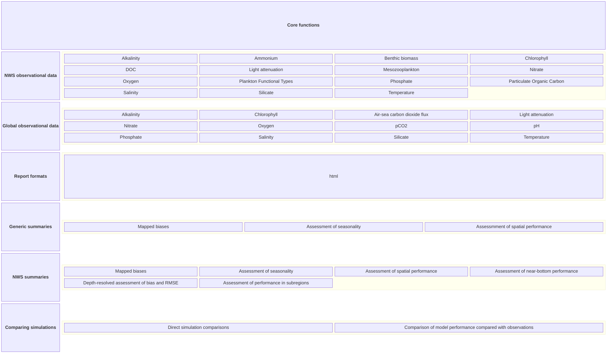

# Development road map

## Core functionality

ecoval is designed to provided automated validation of ERSEM simulations in a matter of hours and significantly reduce the time spent on validation and also dramatically provide its quality and extent. It can provide an automated 200+ page report covering everything from temperature to benthic biomass.

If you are not familiar with what ecoval can do, you can read this [example validation report](https://github.com/pmlmodelling/ecoval/blob/main/examples/comfort_validation.pdf).

It it's core, ecoval is designed to do two things:

1. Automatically matchup model output with observational data, and 
2. Generate a report that summarises the statistical performance of the model output compared with the observational data. 

In Python, this is carried out in 3 quick steps:

```python
import ecoval
ecoval.matchup(...)
ecoval.validate(...)
```

Thousands of lines of code and text are wrapped into 3 lines of code.


The core functionality of ecoval is summarized in the following diagram. 




## Core domains supported

The core functionality of ecoval will be directed at supporting validations of NEMO-ERSEM simulations on the northwest European Shelf. It is possible/likely that a small amount of NC-time can be assigned each year to ensure that the core functionality is maintained, tested and continually improved to meet bread-and-butter NC related modelling work. Given non-northwest European Shelf modelling work is likely to be more ad-hoc, it is unlikely that the core functionality should be supported in an ongoing manner with NC time. They therefore should be supported exclusively through project funding. 


## Funding

Funding for ecoval is currently provided by NC funding, and other projects in a somewhat ad-hoc and ill-defined manner. Moving foward, projects that intend to use ecoval should include this at the proposal stage. This is critical to provide evidence that ecoval is "income generating".


## Data formats supported

ecoval will provide support for NEMO-ERSEM simulations on a running basis. Due to the maintenance costs, support for other data formats will be provided on per-project basis.

FVCOM simulations will be partially supported, with the `fvcom_preprocess` function providing a way to prepare FVCOM data for use with ecoval. This function will be maintained by the FVCOM modelling team at PML. 


## Criteria for adding new functionality

Adding new functionality to ecoval will be guided by the return on investment to PML and developers. The key question is simple. Will this functionality save time and effort in the future? If the answer is yes, then the functionality could be worth adding. The second question is whether there is a clear funding stream to maintain the functionality. If the answer is no, then the functionality should possibly not be added. 

## Project-specific functionality

Projects that plan to use ecoval should ideally write this in at the proposal stage to ensure that time and support is guaranteed and that this is clearly thought through as early as possible. Furthermore, including ecoval at the proposal stage will provide clearer evidence to PML management of its value and importance to the organisation. In some cases, the generic functionality of ecoval will not be sufficient for the project. You can see an example of the generic functionality [here](https://github.com/pmlmodelling/ecoval/blob/main/examples/medusa_salinity.pdf). 


ecoval is designed to produce high-quality reports for the northwest European Shelf, but only fairly generic reports for models in other domains. If you plan to use ecoval for a project outside the northwest European Shelf, you should consider whether detailed region-specific statistics are required. If so, additional functionality will be required in ecoval to support this, and appropriate time should be set aside at the proposal stage.

Project-specific functionality can be added in three ways, moving foward. First, if the modelling study is for the northwest European Shelf, then the functionality can probably be added to the core ecoval package. Otherwise, two approaches can be taken. First, the functionality could be added using a recipe that can supplement the core of ecoval. Essentially, this will slot into the existing report. A second approach will be to create a project-specific version or branch of ecoval. 

## Validation of ERSEM variables not in a stable release

Moving forward, ecoval will focus on validating variables that are available in a stable release of ERSEM. New variables that are candidates for validation will be supported for the duration of the project. However, once the project is finished, the code will be archived and not maintained if it is clear a variable is not to become part of a stable release. This is to ensure that the core functionality of ecoval is maintained and that the package does not become bloated with unmaintained code.  

## Support for pdf reports

ecoval provides reports in both html and pdf formats. However, both reports provide identifical information. Moving forward, the html report will be the primary polished report format, with the pdf report being a secondary unpolished format. There will ongoing maintenance work to ensure that text is formatted correctly in the html report, but this will not occur with the pdf report due to the low return on investment.

Formatting of pdf reports will occur on a per-project basis. In most cases, the html report will be totally sufficient until the project is near the end point when a deliverable report is required. At this point, project time can be set aside to make code modifications to ensure the pdf report is formatted correctly. This is most useful if a deliverable report or paper needs to report validation results for a significant number of variables. 

## Using ecoval for deliverable reports

To ensure deliverable reports can be produced in a less tight timeframe, it is worth considering whether a custom version of ecoval's `validate` method should be created for the project. This is most useful if you are validating an extensive number of variables. A customized version of the `validate` method can be created which will ensure that a significant volume of more or less finalized deliverable report can be produced promptly after the final simulations are ready. This can be developed in an ongoing basis while kinks in the simulation are being worked out.  

## Extension to new domains

ecoval is easily extensible to new domains. The core requirement is that the observational data is suitably format. This data can take two formats. First, gridded data should be in a broadly CF-compliant netCDF format. If so, ecoval will be either be able to matchup simulation output with this file right away or some minor custom modifications can be made. Similarly, point observation data just needs formatted into column based data, where the columns are made up of a combination of lon | lat | year | month | day | depth | observation, where observation is the observed value for the time and location. The `matchup` function and generic summaries provided by `validate` should work out of the box with this data, so long as you have formatted it correctly. However, any custom summaries will need to be developed on a per-project basis.

## Use of ecoval as a monitoring tool

Future work is needed to ensure that ecoval can be used as a monitoring tool for NEMO-ERSEM simulations. This will require some code changes to ensure that the package can be used to monitor simulations during runtime. An advantage of doing this is that problems with simulations can be identified the second they arise, rather than waiting for the end of the simulation. Second, this will also ensure that validation reports are complete when the simulation is finished, rather than running the validation afterwards, which can speed up delivery.

The use of ecoval as a monitoring tool is likely system dependent, and so is best carried out on a per-project basis, instead of as a generic feature of the package. It should therefore be timed-boxed at the proposal stage.

## Focus for 2024/2025

ecoval work will focus largely on improving the long-term sustainability and usability of the package. The following work will be carried out:

- [ ] Improve the documentation of the package, including the code and the report
- [ ] Improve the testing of the package, with more extensive tests carried out using GitHub Actions
- [ ] Improve the usability of the package, with a focus on making it easier to use
- [ ] Improve the performance of the package, with a focus on reducing the time taken to run the `validate` method 

